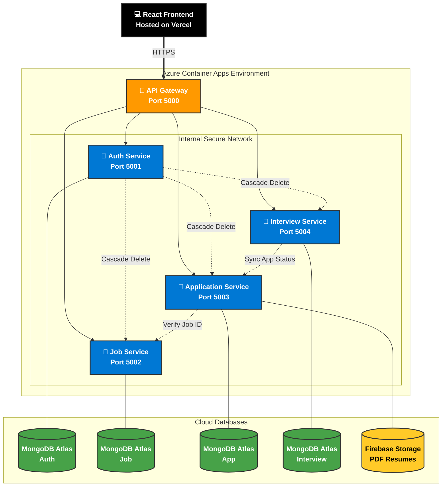

# 🚀 HireSphere - Cloud-Native Talent Platform


HireSphere is an enterprise-grade, microservice-based job portal designed to bridge the gap between world-class talent and next-gen opportunities. Built with a focus on DevSecOps, cloud-native architecture, and real-time processing, it eliminates the friction of traditional hiring processes.

---

## 🏗 Architecture & Visual Flow

The backend is built using a **Microservices Architecture** utilizing the "Database-per-Service" pattern for loose coupling and high availability. 

*Below is the live architectural flow of the application. (Rendered natively by GitHub)*



### 🔄 Inter-Service Communication Details
The services communicate synchronously over the internal network using REST APIs. Key integration points include:
* **Cascading Deletes:** Deleting a user account (Auth) automatically triggers the deletion of their associated Jobs, Applications, and Interviews across other services.
* **Status Synchronization:** When an interview concludes (Interview Service), it automatically updates the overarching application status (Application Service).
* **Job Verification:** Before a candidate can apply (Application Service), the system verifies the active status of the job posting (Job Service).

---

## 🛠 Tech Stack

* **Frontend:** React.js (Vite), Tailwind CSS, Lucide Icons, Axios.
* **Backend:** Node.js, Express.js.
* **Databases:** MongoDB Atlas (Mongoose).
* **Cloud Storage:** Firebase Storage (PDF Resumes).
* **DevSecOps:** Docker, Docker Compose, GitHub Actions (CI/CD), Snyk (SAST).
* **Cloud Hosting:** Azure Container Apps (Backend), Vercel (Frontend).

---

## 🔐 DevSecOps & Cloud Infrastructure

This project implements modern DevOps and Security practices:

| Practice | Implementation |
| :--- | :--- |
| **SAST** | Every GitHub push is scanned by **Snyk** for vulnerabilities before building. |
| **CI/CD** | GitHub Actions automatically build and push container images to Docker Hub. |
| **Zero Trust** | The 4 core microservices use **Internal Ingress** only, completely hidden from the internet. |
| **Auto-Deploy**| Azure uses User-assigned Managed Identities to auto-pull new images from Docker Hub. |

---

## ⚙️ Local Setup & Installation

### Prerequisites
* [Docker Desktop](https://www.docker.com/products/docker-desktop) installed and running.
* Node.js (v18+) for local frontend development.

### 1. Clone the Repository
```bash
git clone [https://github.com/YourUsername/HireSphere.git](https://github.com/YourUsername/HireSphere.git)
cd HireSphere
```

### 2. Environment Variables
You must create a `.env` file in the root directory and inside each microservice. Refer to `docker-compose.yml` for required variables. 

**Global / Root Level (`.env`):**
```env
MONGO_ATLAS_BASE_URI=mongodb+srv://<username>:<password>@cluster0...
FIREBASE_API_KEY=your_api_key
EMAIL_USER=your_email@gmail.com
EMAIL_PASS=your_app_password

FIREBASE_API_KEY=your_firebase_api_key_here
FIREBASE_AUTH_DOMAIN=your-project-id.firebaseapp.com
FIREBASE_PROJECT_ID=your-project-id
FIREBASE_STORAGE_BUCKET=your-project-id.firebasestorage.app
FIREBASE_MESSAGING_SENDER_ID=your_messaging_sender_id
FIREBASE_APP_ID=your_firebase_app_id_here
```

### 3. Run the Backend (Docker)
The easiest way to spin up the entire microservice ecosystem locally is using Docker Compose:
```bash
docker-compose up --build -d
```
*The API Gateway will now be running on `http://localhost:5000`.*

### 4. Run the Frontend
```bash
cd frontend
npm install
npm run dev
```
*The React app will be running on `http://localhost:5173`.*

---

## 📄 API Documentation (Swagger)
OpenAPI/Swagger documentation is fully integrated into the microservices. To view the API Contracts, run the services locally and navigate to:
* 🔐 **Auth Service:** `http://localhost:5001/api-docs`
* 💼 **Job Service:** `http://localhost:5002/api-docs`
* 📄 **Application Service:** `http://localhost:5003/api-docs`
* 🎥 **Interview Service:** `http://localhost:5004/api-docs`
---
*Built with ❤️ by the HireSphere Team.*
